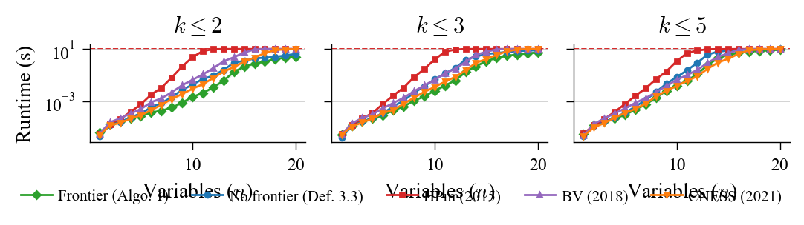

# Productive Actual Causation

Code accompanying the paper **"Productive Actual Causation"**.

## Files

| File | Description |
|------|-------------|
| `causation.py` | Core definition: `SCM`, `Checker` (Def 3.3, Alg 1+2) |
| `bounded_checker.py` | `BoundedChecker` — FPT variant using witness frontier restriction in Alg 2 |
| `hp_modified.py` | HP Modified (2015) baseline |
| `bv_checker.py` | Beckers–Vennekens (2018) baseline |
| `cness_checker.py` | CNESS (Beckers 2021) baseline |
| `scalability.py` | Scalability experiment (random SCMs, runtime comparison) |
| `plot_scalability.py` | Plot generation from experiment CSV |
| `test_checkers.py` | Unit tests — 68 tests covering all 7 paper examples |

## Scalability results



Runtime comparison across definitions on random binary SCMs (n=1–20 variables,
densities 0.2/0.4/0.6, indegree bounds k≤2, k≤3, k≤5, unbounded).
500 seeds for our definition; 50 seeds for baselines. Shaded bands = 95% CI.

## Usage

```bash
pip install -r requirements.txt

# Run unit tests
pytest test_checkers.py -v

# Run scalability experiment
python scalability.py --output results/scalability.csv --workers 8

# Generate plots
python plot_scalability.py --input results/scalability.csv --output-dir results
```

## Quick example

```python
from causation import SCM, Checker

# Preemption: Suzy throws first, Billy would throw if Suzy didn't
scm = SCM(
    equations={
        "ST": lambda p: 1,          # Suzy throws
        "BT": lambda p: 1,          # Billy throws
        "SH": lambda p: p["ST"],    # Suzy hits
        "BH": lambda p: p["BT"] and not p["SH"],  # Billy hits (preempted)
        "BS": lambda p: p["SH"] or p["BH"],        # Bottle shatters
    },
    parents={
        "ST": [], "BT": [],
        "SH": ["ST"], "BH": ["BT", "SH"], "BS": ["SH", "BH"],
    }
)

ck = Checker(scm)
print(ck.is_cause("ST", 1, "BS", 1))  # True  — Suzy causes shattering
print(ck.is_cause("BT", 1, "BS", 1))  # False — Billy preempted
```
